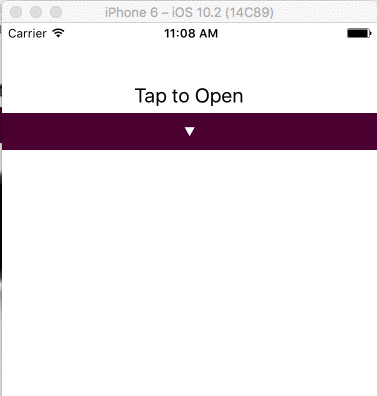

*** Optional Props (See ./example for usage) ***
- maxHeight: How far can the view expand
- minHeight: How much to show in the closed state
- value: true or false
- style: Style of child view
- containerStyle: Style of container
- animatedValue: Optional ```Animated.Value(minHeight)``` used to link animations inline with menu.


***Minimal Example***

```
import Expand = from 'react-native-simple-expand';
```


```
    render() {

        return (
           <View>
               <TouchableOpacity onPress={() => this.setState({ open: !this.state.open })}>
                <Text>Toggle Menu</Text>
               </TouchableOpacity>
               <Expand value={this.state.open}>
                   <Text>
                    Some very very very very very very very very very very very very very very very very very very very very great content
                   </Text>
               </Expand>
           </View>
        );
    }
```
